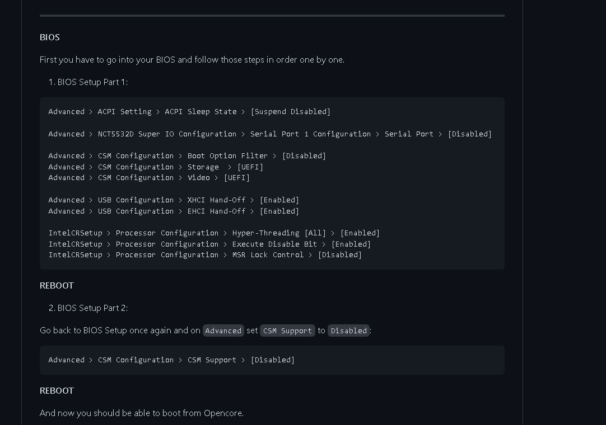

# EFI X99 Para Processadores V3 Sendo Utilizada Com O BIGSUR

Esse é um repositorio baseado nas Repositories Base do  Gabriel Luchina, sendo encontrada a versão  original utilizada em  **[EFF](https://github.com/luchina-gabriel/EFI-X99-HUANANZHI-F8-INTEL-XEON-V3-RX-580-8GB)**

Latest working macOS: 12.1
Current OpenCore: 0.7.7

## Complete hardware specs

Intel Xeon E5-2696 v3 (HEDT Haswell)
Huananzhi F8 - 2021 Version
AMD RX 560 4 Gb (Polaris)
Áudio Codec: Realtek ALC883
Ethernet: Realtek RTL8168/8111 PCI-E Gigabit

## Como Utilizar

Clone esse repositorio  [AQUI](https://github.com/ellcj/EFI/archive/refs/heads/master.zip)
Crie uma folder em seu PC com o nome EFI e extraia os arquivos para essa pasta
Após Formate o pendrive em FAT32 e copie a pasta EFI para a raiz do pendrive
É necessário editar as informações no config.plis que se encontra na pasta OC
Utilze os utilitariios:
  
   [python](https://www.python.org/)
 
   [GenSMBIOS](https://github.com/corpnewt/GenSMBIOS) 

   [ProperTree](https://github.com/corpnewt/ProperTree) 

   [macrecovery](https://github.com/acidanthera/OpenCorePkg/releases)
   
Crie uma pasta como nome com.apple.recovery.boot e cole os 2 arquivoc gerados pelo macrecovery( BaseSystem.chunklist e BaseSystem.dmg)   
   
   A estrutura do pendrive tem que estar montada Dessa forma 
    EFI >Boot..

 Pasta OC

      Varias pastar aqui
        
      
  com.apple.recovery.boot Apenas dois arquivos

         BaseSystem.chunklist

         BaseSystem.dmg
      

Reinicie seu pc e mude as configurações na BIOS igual a imagem, e intale o Teu MAC.OS

What works
macOS Big Sur, macOS Catalina and macOS Monterey
Audio
HDMI/DP
All USB ports
Ethernet
Everything iCloud related (Drive, iMessage, Facetime, unlock with Apple Watch, etc)
Temperature monitoring for everything except GPU (no GPU temp support in VirtualSMC for navi and big navi cards)
DRM content (Netflix, ATV+, Airplay 2 mirroring etc)
Shutdown/Reboot/Update to newer macOS builds over time

## What doesn't work
Correct USB Mapping :(

## Kexts used:
AppleALC.kext
CpuTscSync.kext
Lilu.kext
RealtekRTL8111.kext
SMCProcessor.kext
SMCSuperIO.kext
VirtualSMC.kext
WhateverGreen.kext
XHCI-unsupported.kext

Thanks/Credits
[Opencore Team](https://dortania.github.io/getting-started/)

[BASE EFI Intel Haswell-E (HEDT)](https://github.com/luchina-gabriel/BASE-EFI-INTEL-HEDT-4THGEN-X99-HASWELL-E)
[Gabriel Luchina](https://www.youtube.com/c/GabrielLuchina)
